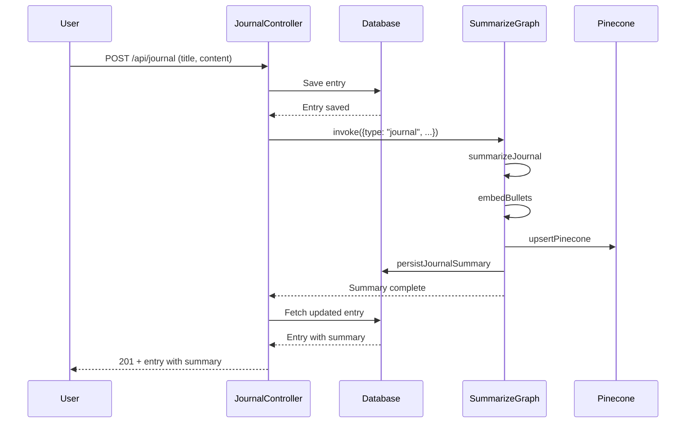
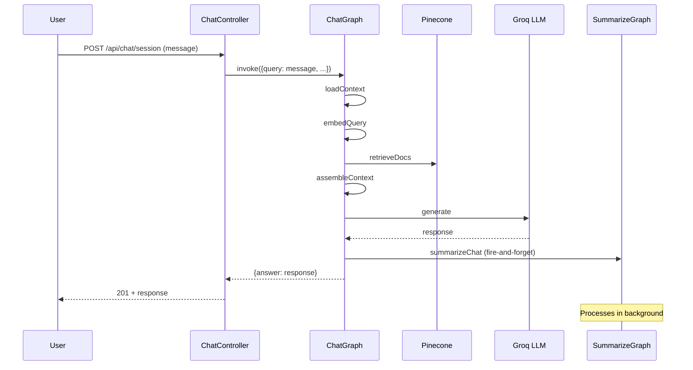
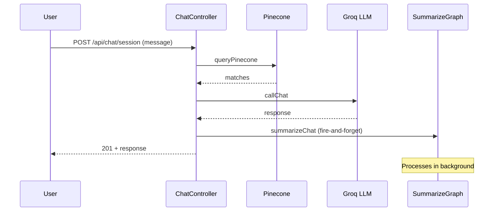

# LangGraph System Documentation

## Table of Contents
1. [High-level Overview](#high-level-overview)
2. [Architecture](#architecture)
3. [Graphs](#graphs)
4. [Data Flow](#data-flow)
5. [Integration Points](#integration-points)
6. [Async Strategy](#async-strategy)
7. [Developer Guide](#developer-guide)
8. [Example End-to-End Flow](#example-end-to-end-flow)

---

## High-level Overview

### Purpose
The LangGraph system provides intelligent conversational AI and automated content summarization for Lumora, a journaling application. It enables context-aware chat responses and automatic extraction of important information from both journal entries and chat conversations.

### Key Components

#### **chatGraph**
- **Purpose**: Handles conversational AI with context retrieval
- **Input**: User query, optional entry ID, conversation history
- **Output**: Contextual AI response
- **Key Feature**: Retrieves relevant journal entries for context

#### **summarizeGraph**
- **Purpose**: Generic post-message processor for content analysis
- **Input**: Content + type ("journal" or "chat")
- **Output**: Summarized data + vector embeddings
- **Key Feature**: Dual-mode processing with conditional logic

### Why LangGraph?

**Benefits:**
- **State Management**: Built-in state channels for data flow
- **Conditional Logic**: Dynamic routing based on content type
- **Observability**: Built-in tracing and metadata
- **Modularity**: Easy to add/remove nodes
- **Error Handling**: Graceful failure handling per node

---

## Architecture

### System Components

```
┌─────────────────┐    ┌─────────────────┐    ┌─────────────────┐
│   Controllers   │    │   LangGraph     │    │   External      │
│                 │    │   Graphs        │    │   Services      │
├─────────────────┤    ├─────────────────┤    ├─────────────────┤
│ journalController│    │ chatGraph       │    │ Groq LLM        │
│ chatController   │    │ summarizeGraph  │    │ Cohere Embed.   │
│                 │    │                 │    │ Pinecone        │
└─────────────────┘    └─────────────────┘    └─────────────────┘
         │                       │                       │
         └───────────────────────┼───────────────────────┘
                                 │
                    ┌─────────────────┐
                    │   Data Layer    │
                    ├─────────────────┤
                    │ JournalEntry    │
                    │ ChatSession     │
                    │ User            │
                    └─────────────────┘
```

### Technology Stack

| Component | Technology | Purpose |
|-----------|------------|---------|
| **LLM** | Groq (llama-3.3-70b-versatile) | Text generation and analysis |
| **Embeddings** | Cohere (embed-english-v3.0) | Vector embeddings |
| **Vector Store** | Pinecone | Semantic search and storage |
| **Framework** | LangGraph | Workflow orchestration |
| **Database** | MongoDB | Document storage |

### Async/Background Processing Strategy

- **Journal Summarization**: Synchronous (returns updated entry)
- **Chat Summarization**: Fire-and-forget (non-blocking)
- **Context Retrieval**: Synchronous (required for response)
- **Vector Operations**: Synchronous (required for search)

---

## Graphs

### chatGraph

#### Purpose
Handles conversational AI with intelligent context retrieval and response generation.

#### Node Breakdown

##### **loadContext**
```javascript
// Purpose: Load entry-specific context if entryId provided
// Input: { userId, entryId, query, messages }
// Output: { ...state, entryTitle, context }
```

**Flow:**
- If `entryId` exists → fetch journal entry
- Set context to entry content
- Set entry title for response

**Example:**
```javascript
// Entry-specific chat
{
  userId: "user123",
  entryId: "entry456", 
  query: "What was I feeling that day?",
  messages: []
}
// Output: Context = "Entry Title: My Anxiety\nEntry Content: I felt really anxious..."
```

##### **embedQuery**
```javascript
// Purpose: Generate embeddings for semantic search
// Input: { query, userId, sessionId }
// Output: { ...state, embedding }
```

**Flow:**
- Skip if entry-specific chat
- Generate Cohere embedding for user query
- Store in state for retrieval

##### **retrieveDocs**
```javascript
// Purpose: Retrieve relevant journal entries from Pinecone
// Input: { embedding, userId }
// Output: { ...state, matches }
```

**Flow:**
- Query Pinecone with embedding
- Filter to recent entries (7 days)
- Return top 5 matches

##### **assembleContext**
```javascript
// Purpose: Build context string for LLM
// Input: { matches, entryTitle, context }
// Output: { ...state, context }
```

**Flow:**
- If entry-specific → use entry context
- If global chat → format matches as context string
- Filter to recent entries only

**Example Output:**
```
1. [2024-01-15] I felt anxious about my presentation | Fear of public speaking | Need confidence building
2. [2024-01-14] Had a great conversation with my therapist | Made progress on communication | Feeling hopeful
```

##### **generate**
```javascript
// Purpose: Generate AI response with context
// Input: { query, context, messages }
// Output: { ...state, answer }
```

**Flow:**
- Build system prompt for Lumora personality
- Assemble user prompt with context
- Call Groq LLM
- Return generated response

##### **summarizeChat**
```javascript
// Purpose: Process user message for important information
// Input: { userId, query }
// Output: { ...state } (fire-and-forget)
```

**Flow:**
- Call summarizeGraph with type "chat"
- Process asynchronously
- Don't block response

### summarizeGraph

#### Purpose
Generic post-message processor with dual-mode operation for journal and chat content.

#### Dual-Mode Design

##### **Journal Mode (`type: "journal"`)**
```javascript
// Full pipeline: summarize → embed → upsert → persist
START → summarizeJournal → embedBullets → upsertPinecone → persistJournalSummary → END
```

**Nodes:**

###### **summarizeJournal**
```javascript
// Purpose: Full content analysis
// Input: { content, userId, entryId }
// Output: { ...state, summaryData }
```

**Analysis Includes:**
- Summary (concise overview)
- Bullets (key points)
- Mood (emotional state)
- Tags (topics/themes)
- Sentiment (positive/negative/neutral)
- Intent (purpose/goal)

**Example Output:**
```javascript
{
  summary: "User expresses anxiety about public speaking and career advancement",
  bullets: [
    "Fear of public speaking is limiting career growth",
    "Spent hours preparing but still feels unprepared", 
    "Needs to work on confidence building",
    "Considering public speaking course"
  ],
  mood: "anxious",
  tags: ["public speaking", "career", "confidence", "fear"],
  sentiment: "negative",
  intent: "self-reflection"
}
```

###### **embedBullets**
```javascript
// Purpose: Generate vector embeddings
// Input: { summaryData.bullets }
// Output: { ...state, embedding }
```

**Flow:**
- Join bullet points into single text
- Generate Cohere embedding
- Store for vector search

###### **upsertPinecone**
```javascript
// Purpose: Store in vector database
// Input: { embedding, summaryData, metadata }
// Output: { ...state, upserted: true }
```

**Metadata Structure:**
```javascript
{
  entryId: "entry123",
  userId: "user456",
  date: "2024-01-15T10:30:00Z",
  title: "My Anxiety",
  summary: "User expresses anxiety...",
  bullets: ["Fear of public speaking..."],
  tags: ["public speaking", "career"],
  sentiment: "negative",
  intent: "self-reflection",
  type: "journal"
}
```

###### **persistJournalSummary**
```javascript
// Purpose: Update database entry
// Input: { entryId, summaryData }
// Output: { ...state }
```

**Flow:**
- Find journal entry by ID
- Update with summary data
- Preserve original createdAt

##### **Chat Mode (`type: "chat"`)**
```javascript
// Conditional pipeline: classify → [generateBullets] → embed → upsert
START → classifyChatImportance → [generateChatBullets] → embedBullets → upsertPinecone → END
```

**Nodes:**

###### **classifyChatImportance**
```javascript
// Purpose: Determine if message contains important information
// Input: { content }
// Output: { ...state, importanceData }
```

**Example Output:**
```javascript
{
  isImportant: true,
  reason: "Contains personal insight about communication patterns and family relationships"
}
```

###### **generateChatBullets**
```javascript
// Purpose: Extract key points from important messages
// Input: { content, importanceData }
// Output: { ...state, bulletsData }
```

**Conditional Execution:**
- Only runs if `importanceData.isImportant === true`
- Otherwise, graph ends here

**Example Output:**
```javascript
{
  bullets: [
    "Avoiding difficult family conversations due to conflict fear",
    "This avoidance is causing significant stress",
    "Needs to improve communication skills"
  ]
}
```

---

## Data Flow

### Sequence Diagrams

#### Journal Entry Creation Flow


#### Chat Message Flow (LangGraph Mode)


#### Chat Message Flow (Non-LangGraph Mode)


### Timing Strategy

| Operation | Timing | Reason |
|-----------|--------|--------|
| **Journal Summarization** | Immediately after DB save | Return updated entry to user |
| **Chat Summarization** | After LLM response | Don't block user experience |
| **Context Retrieval** | Before LLM call | Required for response generation |
| **Vector Operations** | Synchronous | Required for search functionality |

### Example Payloads

#### chatGraph Input
```javascript
{
  userId: "user123",
  sessionId: "session456",
  entryId: null, // or "entry789" for entry-specific
  query: "What patterns do you see in my anxiety?",
  messages: [
    { role: "user", content: "I've been feeling anxious lately" },
    { role: "assistant", content: "I understand. Let's explore that..." }
  ]
}
```

#### chatGraph Output
```javascript
{
  userId: "user123",
  sessionId: "session456",
  entryId: null,
  query: "What patterns do you see in my anxiety?",
  messages: [...],
  embedding: [0.1, 0.2, ...],
  matches: [
    {
      id: "entry123",
      score: 0.85,
      metadata: {
        summary: "User expresses anxiety about work",
        bullets: ["Work stress", "Deadline pressure"],
        date: "2024-01-15T10:30:00Z"
      }
    }
  ],
  context: "1. [2024-01-15] User expresses anxiety about work | Work stress | Deadline pressure",
  answer: "Based on your journal entries, I notice a pattern of anxiety around work deadlines..."
}
```

#### summarizeGraph Input (Journal)
```javascript
{
  type: "journal",
  userId: "user123",
  entryId: "entry456",
  title: "My Anxiety",
  content: "Today I felt really anxious about my upcoming presentation..."
}
```

#### summarizeGraph Input (Chat)
```javascript
{
  type: "chat",
  userId: "user123",
  content: "I just realized I've been avoiding difficult conversations..."
}
```

---

## Integration Points

### Controller Integration

#### Journal Controller
```javascript
// createEntry
if (process.env.LLM_ENGINE === 'langgraph') {
  await summarizeGraph.invoke({ 
    type: 'journal',
    userId: req.user.userId, 
    entryId: entry._id.toString(), 
    title: entry.title, 
    content: entry.content 
  });
  const refreshed = await JournalEntry.findById(entry._id);
  return res.status(201).json(refreshed);
}

// updateEntry
if (process.env.LLM_ENGINE === 'langgraph') {
  await summarizeGraph.invoke({ 
    type: 'journal',
    userId: req.user.userId, 
    entryId: entry._id.toString(), 
    title: entry.title, 
    content: entry.content 
  });
  const refreshed = await JournalEntry.findById(entry._id);
  return res.json(refreshed);
}
```

#### Chat Controller
```javascript
// startChatSession (non-langgraph mode)
summarizeGraph.invoke({
  type: 'chat',
  userId: userId,
  content: message,
}).catch(error => {
  console.error('Chat summarization error:', error.message);
});

// continueChatSession (non-langgraph mode)
summarizeGraph.invoke({
  type: 'chat',
  userId: userId,
  content: message,
}).catch(error => {
  console.error('Chat summarization error:', error.message);
});
```

### Graph Interaction

#### chatGraph → summarizeGraph
```javascript
// In chatGraph.js
graph.addNode('summarizeChat', async (state) => {
  summarizeGraph.invoke({
    type: 'chat',
    userId: state.userId,
    content: state.query,
  }).catch(error => {
    console.error('Chat summarization error:', error.message);
  });
  return state; // Returns immediately
});
```

### Pinecone Integration

#### Vector Storage Strategy
```javascript
// Journal entries: Full metadata
{
  id: entryId,
  values: embedding,
  metadata: {
    entryId: "entry123",
    userId: "user456",
    date: "2024-01-15T10:30:00Z",
    title: "My Anxiety",
    summary: "User expresses anxiety...",
    bullets: ["Fear of public speaking..."],
    tags: ["public speaking", "career"],
    sentiment: "negative",
    intent: "self-reflection",
    type: "journal"
  }
}

// Chat messages: Minimal metadata
{
  id: `chat_${userId}_${timestamp}`,
  values: embedding,
  metadata: {
    userId: "user456",
    date: "2024-01-15T10:30:00Z",
    content: "I just realized...",
    bullets: ["Avoiding difficult conversations..."],
    importance: "Contains personal insight...",
    type: "chat"
  }
}
```

### Error Handling Strategy

#### Journal Summarization
```javascript
// Synchronous - errors are thrown
try {
  await summarizeGraph.invoke({ type: 'journal', ... });
} catch (error) {
  // Log and potentially retry
  console.error('Journal summarization failed:', error);
  // Could implement retry logic here
}
```

#### Chat Summarization
```javascript
// Fire-and-forget - errors are caught and logged
summarizeGraph.invoke({ type: 'chat', ... })
  .catch(error => {
    console.error('Chat summarization error:', error.message);
    // Don't affect user experience
  });
```

---

## Async Strategy

### Why Fire-and-Forget for Chat?

#### **User Experience Priority**
- **Before**: Chat responses delayed by 1-3 seconds
- **After**: Instant responses, background processing

#### **Performance Impact**
```javascript
// Synchronous (blocking)
const start = Date.now();
await summarizeGraph.invoke({ type: 'chat', ... });
const response = await generateResponse();
console.log(`Total time: ${Date.now() - start}ms`); // 2000-4000ms

// Fire-and-forget (non-blocking)
const start = Date.now();
summarizeGraph.invoke({ type: 'chat', ... }).catch(console.error);
const response = await generateResponse();
console.log(`Total time: ${Date.now() - start}ms`); // 500-1000ms
```

#### **Trade-offs**

| Approach | Pros | Cons |
|----------|------|------|
| **Synchronous** | Guaranteed processing, error handling | Blocks user experience |
| **Fire-and-forget** | Instant responses, better UX | Potential data loss, harder debugging |

### Implementation Details

#### **Error Handling**
```javascript
// Graceful degradation
summarizeGraph.invoke({ type: 'chat', ... })
  .catch(error => {
    console.error('Chat summarization error:', error.message);
    // Could implement retry logic or alerting here
  });
```

#### **Monitoring**
```javascript
// Add metrics for background processing
const start = Date.now();
summarizeGraph.invoke({ type: 'chat', ... })
  .then(() => {
    console.log(`Chat summarization completed in ${Date.now() - start}ms`);
  })
  .catch(error => {
    console.error(`Chat summarization failed after ${Date.now() - start}ms:`, error);
  });
```

---

## Developer Guide

### Adding a New Node to a Graph

#### **Step 1: Define Node Function**
```javascript
graph.addNode('newNode', async (state) => {
  // Access input from state
  const { input1, input2 } = state;
  
  // Process data
  const result = await processData(input1, input2);
  
  // Return updated state
  return { ...state, output: result };
});
```

#### **Step 2: Add to Graph Flow**
```javascript
// Add edge to connect nodes
graph.addEdge('previousNode', 'newNode');
graph.addEdge('newNode', 'nextNode');

// Or add conditional edge
graph.addConditionalEdges('previousNode', (state) => {
  if (state.someCondition) return 'newNode';
  return 'otherNode';
});
```

#### **Step 3: Update State Channels**
```javascript
const graph = new StateGraph({
  channels: {
    // ... existing channels
    output: { default: null }, // Add new channel
  },
});
```

### Adding a New Summarization Type

#### **Step 1: Add Type to Conditional Logic**
```javascript
graph.addConditionalEdges(START, (state) => {
  if (state.type === 'journal') return 'summarizeJournal';
  if (state.type === 'chat') return 'classifyChatImportance';
  if (state.type === 'goal') return 'summarizeGoal'; // New type
  return END;
});
```

#### **Step 2: Create New Node**
```javascript
graph.addNode('summarizeGoal', async (state) => {
  const system = `You are Lumora, analyzing goal-related content. Return JSON only.`;
  const user = `Analyze this goal: "${state.content}"\n\nReturn JSON with keys: summary, progress, obstacles, nextSteps`;
  
  const messages = [
    { role: 'system', content: system },
    { role: 'user', content: user },
  ];
  
  const res = await llm.invoke(messages);
  const parsed = GoalSchema.parse(JSON.parse(extractJSON(res)));
  
  return { ...state, goalData: parsed };
});
```

#### **Step 3: Add Schema**
```javascript
const GoalSchema = z.object({
  summary: z.string(),
  progress: z.string(),
  obstacles: z.array(z.string()),
  nextSteps: z.array(z.string()),
});
```

#### **Step 4: Update Metadata Structure**
```javascript
// In upsertPinecone node
if (state.type === 'goal') {
  metadata = {
    ...metadata,
    goalId: state.goalId,
    progress: state.goalData.progress,
    obstacles: state.goalData.obstacles,
    nextSteps: state.goalData.nextSteps,
    type: 'goal',
  };
}
```

### Debugging LangGraph Flows

#### **Enable Tracing**
```javascript
const result = await compiled.invoke(input, {
  configurable: { thread_id: 'debug-session-123' },
  tags: ['debug', 'user-session'],
  metadata: { userId: 'user123', debug: true }
});
```

#### **Add Logging to Nodes**
```javascript
graph.addNode('debugNode', async (state) => {
  console.log('Debug node input:', JSON.stringify(state, null, 2));
  
  // Process state
  const result = await processState(state);
  
  console.log('Debug node output:', JSON.stringify(result, null, 2));
  return result;
});
```

#### **Monitor State Changes**
```javascript
// Add to graph compilation
return graph.compile({
  checkpointer: new MemorySaver(),
  debug: true, // Enable debug mode
});
```

### Testing Strategies

#### **Unit Testing Nodes**
```javascript
// test/summarizeGraph.test.js
describe('summarizeJournal node', () => {
  it('should process journal content correctly', async () => {
    const state = {
      type: 'journal',
      userId: 'test-user',
      content: 'Test journal content',
    };
    
    const result = await summarizeJournalNode(state);
    
    expect(result.summaryData).toBeDefined();
    expect(result.summaryData.summary).toBeTruthy();
    expect(result.summaryData.bullets).toHaveLength(4);
  });
});
```

#### **Integration Testing**
```javascript
// test/graphIntegration.test.js
describe('summarizeGraph integration', () => {
  it('should process journal entry end-to-end', async () => {
    const input = {
      type: 'journal',
      userId: 'test-user',
      entryId: 'test-entry',
      title: 'Test Entry',
      content: 'Test content',
    };
    
    const result = await summarizeGraph.invoke(input);
    
    expect(result.upserted).toBe(true);
    expect(result.summaryData).toBeDefined();
  });
});
```

#### **Performance Testing**
```javascript
// test/performance.test.js
describe('chatGraph performance', () => {
  it('should respond within acceptable time', async () => {
    const start = Date.now();
    
    await chatGraph.invoke({
      userId: 'test-user',
      query: 'Test query',
      messages: [],
    });
    
    const duration = Date.now() - start;
    expect(duration).toBeLessThan(2000); // 2 seconds max
  });
});
```

---

## Example End-to-End Flow

### Scenario: User Asks About Anxiety Patterns

#### **1. User Sends Message**
```javascript
// POST /api/chat/session
{
  "message": "What patterns do you see in my anxiety?",
  "entryId": null
}
```

#### **2. Chat Controller Processes**
```javascript
// chatController.js
if (process.env.LLM_ENGINE === 'langgraph') {
  const result = await chatGraph.invoke({ 
    userId, 
    sessionId: null, 
    entryId: null, 
    query: message, 
    messages: [] 
  });
}
```

#### **3. chatGraph Execution**

##### **loadContext Node**
```javascript
// No entryId, so context remains empty
{
  userId: "user123",
  entryId: null,
  query: "What patterns do you see in my anxiety?",
  context: ""
}
```

##### **embedQuery Node**
```javascript
// Generate embedding for semantic search
const embedding = await cohereEmbeddings.embedQuery(
  "What patterns do you see in my anxiety?"
);
// embedding: [0.1, 0.2, 0.3, ...]
```

##### **retrieveDocs Node**
```javascript
// Query Pinecone for relevant entries
const matches = await pineconeQuery({ 
  embedding, 
  topK: 5, 
  namespace: 'default' 
});

// matches: [
//   {
//     id: "entry123",
//     score: 0.85,
//     metadata: {
//       summary: "User expresses anxiety about work deadlines",
//       bullets: ["Work stress", "Deadline pressure", "Fear of failure"],
//       date: "2024-01-15T10:30:00Z"
//     }
//   },
//   // ... more matches
// ]
```

##### **assembleContext Node**
```javascript
// Build context string for LLM
const context = matches
  .filter(m => new Date(m.metadata?.date) >= new Date(Date.now() - 7*24*60*60*1000))
  .map((m, i) => {
    const date = new Date(m.metadata.date).toLocaleDateString();
    const summary = m.metadata.summary;
    const bullets = m.metadata.bullets.join(' | ');
    return `${i + 1}. [${date}] ${summary} | ${bullets}`;
  })
  .join('\n');

// context: "1. [1/15/2024] User expresses anxiety about work deadlines | Work stress | Deadline pressure | Fear of failure"
```

##### **generate Node**
```javascript
// Build system prompt
const system = [
  "You are Lumora, a kind and understanding journaling companion.",
  "Talk to the user like a supportive friend would — warm, gentle, and empathetic.",
  "Weave in past journal insights only when they truly help the user reflect.",
  // ... more system instructions
].join(' ');

// Build user prompt
const userPrompt = [
  `A user asked: "What patterns do you see in my anxiety?"`,
  'Here are the most relevant past journal summaries:',
  context,
  'Please answer grounded in these entries.',
].join('\n\n');

// Call LLM
const messages = [
  { role: 'system', content: system },
  { role: 'user', content: userPrompt },
];

const res = await llm.invoke(messages);
const answer = res.content;

// answer: "Based on your journal entries, I notice a clear pattern of anxiety around work-related deadlines..."
```

##### **summarizeChat Node**
```javascript
// Fire-and-forget summarization
summarizeGraph.invoke({
  type: 'chat',
  userId: 'user123',
  content: 'What patterns do you see in my anxiety?',
}).catch(error => {
  console.error('Chat summarization error:', error.message);
});

// Returns immediately, doesn't wait for completion
```

#### **4. summarizeGraph Execution (Background)**

##### **classifyChatImportance Node**
```javascript
// Determine if message is important
const importanceResult = await llm.invoke([
  { role: 'system', content: 'You are Lumora, determining if chat messages contain important information...' },
  { role: 'user', content: 'Analyze this message: "What patterns do you see in my anxiety?"' }
]);

// importanceData: {
//   isImportant: true,
//   reason: "User is seeking self-reflection and pattern recognition, which indicates important introspection"
// }
```

##### **generateChatBullets Node**
```javascript
// Extract key points (only if important)
const bulletsResult = await llm.invoke([
  { role: 'system', content: 'You are Lumora, extracting key points from important chat messages...' },
  { role: 'user', content: 'Extract key points from: "What patterns do you see in my anxiety?"' }
]);

// bulletsData: {
//   bullets: [
//     "User seeking pattern recognition in anxiety",
//     "Shows self-reflection and introspection",
//     "Indicates desire for understanding and growth"
//   ]
// }
```

##### **embedBullets Node**
```javascript
// Generate embeddings for vector storage
const bulletText = bulletsData.bullets.join(' ');
const embedding = await cohereEmbeddings.embedQuery(bulletText);
// embedding: [0.4, 0.5, 0.6, ...]
```

##### **upsertPinecone Node**
```javascript
// Store in vector database
await pineconeUpsert({
  id: `chat_user123_${Date.now()}`,
  embedding: embedding,
  metadata: {
    userId: 'user123',
    date: '2024-01-15T14:30:00Z',
    content: 'What patterns do you see in my anxiety?',
    bullets: [
      'User seeking pattern recognition in anxiety',
      'Shows self-reflection and introspection', 
      'Indicates desire for understanding and growth'
    ],
    importance: 'User is seeking self-reflection and pattern recognition...',
    type: 'chat'
  }
});
```

#### **5. Response to User**
```javascript
// Return to user immediately
{
  sessionId: "session789",
  messages: [
    { role: 'user', content: 'What patterns do you see in my anxiety?' },
    { role: 'ai', content: 'Based on your journal entries, I notice a clear pattern of anxiety around work-related deadlines...' }
  ],
  answer: 'Based on your journal entries, I notice a clear pattern of anxiety around work-related deadlines...',
  title: 'What patterns do you see in my anxiety?'
}
```

#### **6. Vector Store Updated**
- New chat message stored in Pinecone with metadata
- Available for future context retrieval
- Enables pattern recognition across conversations

### Key Benefits of This Flow

1. **Instant Response**: User gets immediate answer
2. **Context-Aware**: Response based on relevant journal entries
3. **Background Processing**: Important information extracted without delay
4. **Memory Building**: Chat insights stored for future reference
5. **Scalable**: Fire-and-forget processing doesn't block system

---

## Conclusion

The LangGraph system provides a robust, scalable foundation for intelligent conversational AI and automated content analysis. The dual-mode summarization approach ensures that both structured journal entries and unstructured chat conversations are processed appropriately, while the async strategy maintains excellent user experience.

Key architectural decisions:
- **Conditional processing** based on content type
- **Fire-and-forget** for chat summarization
- **Synchronous** for journal summarization
- **Modular node design** for easy extension
- **Comprehensive error handling** with graceful degradation

This system enables Lumora to provide context-aware, personalized responses while continuously building a knowledge base of user insights and patterns. 